# Agent Reasoning Patterns

The catalogue of reasoning patterns the Agent Loop Advisor selects from, each with its canonical diagram (in the style of the field guide), what it does, when it beats a plain grounded agent, and **how it differs from the nearest alternatives** — the choice the Advisor is actually making for you.

> Every pattern is a variation of one control loop — **generate → evaluate → select → repair → escalate**. They differ in *what* is generated and *what* evaluates it; the evaluator is the architecture.

## Quick selection — problem to pattern

| If the problem is… | Pattern | Beats a baseline when |
|---|---|---|
| Missing or stale facts | **00 Grounded single agent** | It is the baseline. Every other candidate must beat it on quality or cost |
| Correct facts, weak judgement | **01 From chain-of-thought to deliberate reasoning** | The facts are already available and the failure is in judgement, not retrieval |
| Multiple plausible interpretations, first answer often wrong | **05 Tree of thoughts and branching reasoning** | The first plausible explanation is often wrong and being wrong is expensive |
| Needs tools, data lookups or actions mid-reasoning | **02 Reasoning and acting, the ReAct loop** | The answer requires live lookups or actions that cannot be pre-retrieved |
| Planning under constraints with many valid options | **09 Search-based reasoning and controlled exploration** | Many candidate plans are valid, hard constraints can kill most of them cheaply, and the ordering matters |
| Relationship discovery, no single document has the answer | **10 Graph reasoning** | The answer lives in relationships between records, so no single document contains it |
| Needs recall across sessions, personalised or accumulating context | **06 Memory-augmented reasoning** | Quality depends on what happened in earlier sessions, not just this one |
| Workflow too large or heterogeneous for one agent | **03 Multi-agent orchestration and model selection** | The task decomposes into 2 to 4 narrow subtasks whose worker calls can run on small models |
| Long-running business process with defined stages | **08 Workflow-state reasoning with human in the loop** | The process spans hours or days, survives restarts, and has states that must not involve a model at all |
| Repeated task that should improve run over run | **07 Reflection and dynamic skill acquisition** | The same task recurs often enough that a captured lesson pays back the reflection cost |
| Validated artefacts required, not advice | **11 Program synthesis and test-repair** | The deliverable is an artefact that a test suite can judge, so the evaluator is free and cannot be flattered |
| Deterministic policy compliance required | **04 Neuro-symbolic reasoning** | A policy must hold every time, not usually. A tendency is not a guarantee |
| Human judgement is part of output quality, not just a gate | **13 Human-in-the-loop reasoning** | Failure is expensive enough to be worth a person's attention budget |
| — (composition / control element) | **12 The pattern compiler** | The same translation from requirements to architecture happens repeatedly and its quality currently depends on who is holding the pen |

## How patterns combine

Patterns are not used in isolation — the Advisor composes them with five operators, joining at the seams of the control loop rather than with ad-hoc glue:

- **sequence** — one pattern's output feeds the next (`10 → 05`).
- **guard** — a pattern wraps another's action boundary; the guard's verdict wins (`guard(02, 04)`).
- **nest** — a pattern occupies one decision node inside another (`nest(08, 05)`).
- **fan** — parallel expansion then a typed merge (`03`).
- **substitute** — replace the evaluator inside a loop (`substitute(01, 11)`).

## The patterns

### 00 · Grounded single agent (candidate zero)
*Family: Baseline*

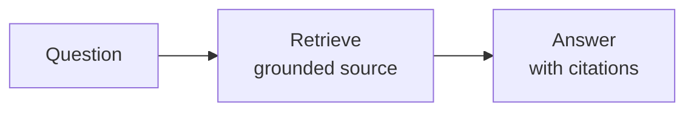

**What it does.** One agent, grounded on a knowledge source, no orchestration. The falsifiability test every other candidate must beat. §4: grounding is not reasoning, and if grounding is enough you stop here.

**Beats a grounded baseline when.** It is the baseline. Every other candidate must beat it on quality or cost.

**How it differs from the alternatives.** The floor every other pattern must beat. Pure retrieve-and-cite with **no** comparison, planning, verification or action. Choose it when the answer already exists in a document; choose anything else only when grounding demonstrably is not enough.

- **Accepts → produces:** Question, Case → Answer
- **Evaluator:** model_judge on the final
- **Cost / latency class:** low / fast
- **Composes with:** —
- **Known failure modes:** ungrounded claims
- **Azure services:** foundry_agent_service, ai_search

### 01 · From chain-of-thought to deliberate reasoning
*Family: Reasoning & judgement*

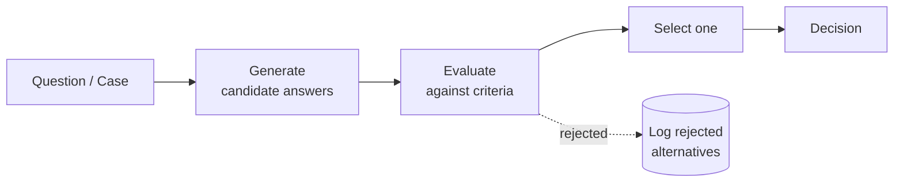

**What it does.** Generate candidate answers, evaluate them against criteria, select one and say why the others lost.

**Beats a grounded baseline when.** The facts are already available and the failure is in judgement, not retrieval.

**How it differs from the alternatives.** Adds judgement **over** already-retrieved facts. Differs from **00** by comparing candidates and saying why the losers lost; differs from **05 branching** by running a single generate–evaluate–select round rather than holding several competing hypotheses across rounds. Choose it when the facts are present and the first answer merely needs checking, not a full investigation.

- **Accepts → produces:** Question, Case, Evidence, GraphContext, MemoryContext → Decision
- **Evaluator:** model_judge on the final
- **Cost / latency class:** medium / medium
- **Composes with:** 04, 13, 11, 06, 10
- **Known failure modes:** false confidence from length, weak evaluator, judge flattery
- **Azure services:** foundry_agent_service, evaluations

### 05 · Tree of thoughts and branching reasoning
*Family: Reasoning & judgement*

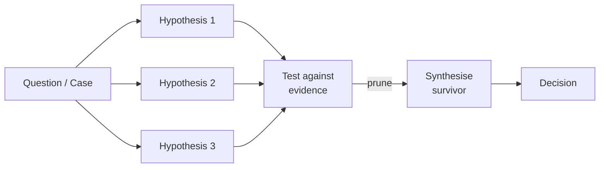

**What it does.** Several hypotheses live at once, evidence prunes them, the survivor is synthesised into a verdict.

**Beats a grounded baseline when.** The first plausible explanation is often wrong and being wrong is expensive.

**How it differs from the alternatives.** Holds **several hypotheses at once** and prunes them against evidence over rounds. Differs from **01** (one round, one candidate line) by exploring competing explanations; differs from **09** by branching over *interpretations* rather than searching over *plans*. Choose it when the first plausible explanation is often wrong and being wrong is expensive.

- **Accepts → produces:** Question, Case, Evidence, GraphContext → Decision
- **Evaluator:** hybrid on the trajectory
- **Cost / latency class:** high / slow
- **Composes with:** 04, 13, 10, 08, 02
- **Known failure modes:** over branching, hidden cost explosion, premature pruning
- **Azure services:** foundry_agent_service, app_insights

### 02 · Reasoning and acting, the ReAct loop
*Family: Action & tools*

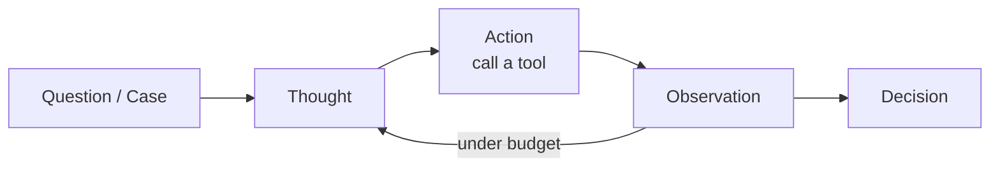

**What it does.** Thought, action, observation, repeated under a budget, with tools and a knowledge base.

**Beats a grounded baseline when.** The answer requires live lookups or actions that cannot be pre-retrieved.

**How it differs from the alternatives.** The only core pattern that calls tools **mid-reasoning**. Differs from **00/01** (which reason over a fixed evidence set) by looking things up or acting as it goes; differs from **03** by being one actor in a loop rather than many. Choose it when the answer needs live lookups or actions that cannot be pre-retrieved.

- **Accepts → produces:** Question, Case, MemoryContext, GraphContext → Decision
- **Evaluator:** hybrid on the trajectory
- **Cost / latency class:** medium / medium
- **Composes with:** 04, 13, 06, 08, 10
- **Known failure modes:** hallucinated tool arguments, prompt injection via observations, unbounded loop
- **Azure services:** foundry_agent_service, mcp_container_app, ai_search, app_insights

### 09 · Search-based reasoning and controlled exploration
*Family: Planning*

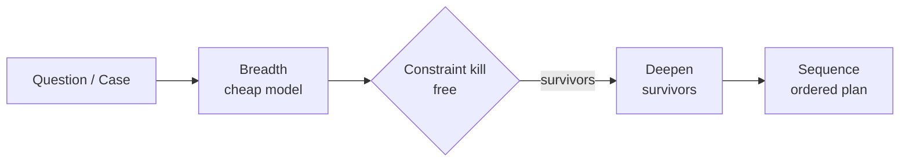

**What it does.** Breadth on a cheap model, a free deterministic constraint kill, then depth on the survivors.

**Beats a grounded baseline when.** Many candidate plans are valid, hard constraints can kill most of them cheaply, and the ordering matters.

**How it differs from the alternatives.** Searches a **space of plans**: breadth on a cheap model, a free deterministic constraint kill, then depth on the survivors. Differs from **05** by searching *orderings/plans* rather than *hypotheses*; differs from **01** when there are many valid options and ordering matters. Choose it for planning under hard constraints.

- **Accepts → produces:** Question, Case, GraphContext → Sequence
- **Evaluator:** hybrid on the trajectory
- **Cost / latency class:** high / slow
- **Composes with:** 04, 13, 08, 10
- **Known failure modes:** over branching, hidden cost explosion, injection via observations
- **Azure services:** foundry_agent_service, mcp_container_app, content_safety

### 10 · Graph reasoning
*Family: Context*

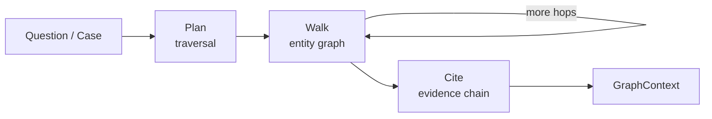

**What it does.** The model plans traversals over an entity graph and cites the chain of evidence it walked.

**Beats a grounded baseline when.** The answer lives in relationships between records, so no single document contains it.

**How it differs from the alternatives.** A **context** provider for answers that live in **relationships** across records. Differs from **00/06** (single document / prior sessions) by traversing an entity graph and citing the chain it walked. Feeds reasoners like **05/01/08**. Choose it when no single record holds the answer.

- **Accepts → produces:** Question, Case → GraphContext
- **Evaluator:** hybrid on the trajectory
- **Cost / latency class:** medium / medium
- **Composes with:** 01, 03, 05, 08, 09
- **Known failure modes:** entity resolution errors, uncited chains, hop explosion
- **Azure services:** foundry_agent_service, mcp_container_app, fabric

### 06 · Memory-augmented reasoning
*Family: Context*

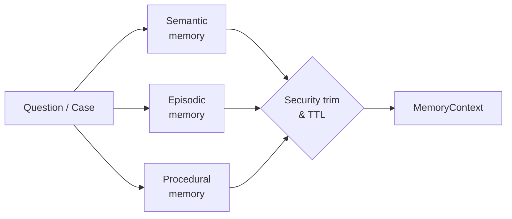

**What it does.** Semantic, episodic and procedural memory, scoped and security-trimmed, with an explicit TTL.

**Beats a grounded baseline when.** Quality depends on what happened in earlier sessions, not just this one.

**How it differs from the alternatives.** A **context** provider, not a decider: scoped, security-trimmed, TTL'd memory across sessions. Differs from **00** by remembering earlier sessions; feeds reasoners like **01/02/08**. Choose it when quality depends on what happened before, not just this turn.

- **Accepts → produces:** Question, Case → MemoryContext
- **Evaluator:** hybrid on the final
- **Cost / latency class:** low / fast
- **Composes with:** 01, 02, 03, 08
- **Known failure modes:** stale memory recalled as fact, missing security trim, unbounded growth
- **Azure services:** foundry_agent_service, ai_search, table_storage

### 03 · Multi-agent orchestration and model selection
*Family: Orchestration*

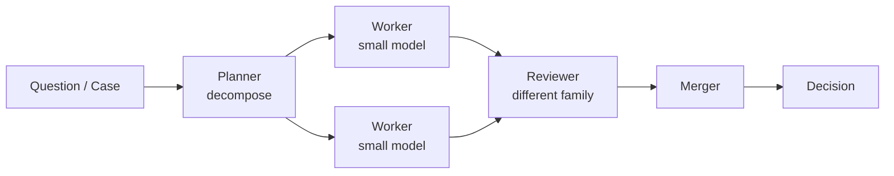

**What it does.** Planner decomposes, workers fan out on small models, a different-family reviewer checks, a merger writes the answer.

**Beats a grounded baseline when.** The task decomposes into 2 to 4 narrow subtasks whose worker calls can run on small models.

**How it differs from the alternatives.** Decomposes a job **too large for one agent** into a planner, parallel workers on small models, a different-family reviewer and a merger. Differs from **01/05** (single agent) by breadth; differs from **08** by being stateless orchestration rather than a durable, multi-day state machine. Choose it when the work splits into 2–4 narrow subtasks.

- **Accepts → produces:** Question, Case, GraphContext → Decision
- **Evaluator:** model_judge on the trajectory
- **Cost / latency class:** high / slow
- **Composes with:** 04, 13, 10, 08
- **Known failure modes:** agent sprawl, circular debate, correlated review blind spots, free text handoffs
- **Azure services:** foundry_agent_service, blob_storage, model_router, app_insights

### 08 · Workflow-state reasoning with human in the loop
*Family: Process*

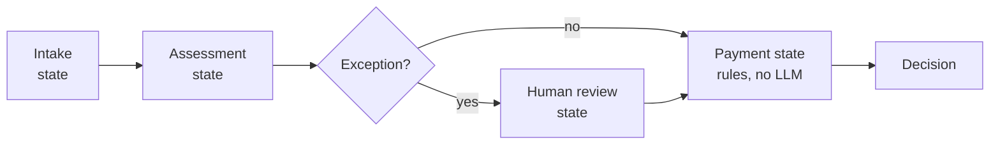

**What it does.** A durable state machine owns the business process, agents own judgement inside named decision points, humans occupy specific states.

**Beats a grounded baseline when.** The process spans hours or days, survives restarts, and has states that must not involve a model at all.

**How it differs from the alternatives.** A **durable state machine** owns a business process across hours or days; agents own judgement at named decision states; some states have no model at all. Differs from **03** by persistence and defined stages; differs from **13** by owning the whole process, with human review as one state. Choose it for long-running, restartable processes with regulated steps.

- **Accepts → produces:** Case, GraphContext, MemoryContext → Decision
- **Evaluator:** hybrid on the trajectory
- **Cost / latency class:** medium / process
- **Composes with:** 01, 02, 04, 05, 06, 09, 10, 11, 13
- **Known failure modes:** approval theatre, non determinism in regulated path, missing compensation
- **Azure services:** foundry_agent_service, durable_functions, table_storage, app_insights

### 07 · Reflection and dynamic skill acquisition
*Family: Improvement*

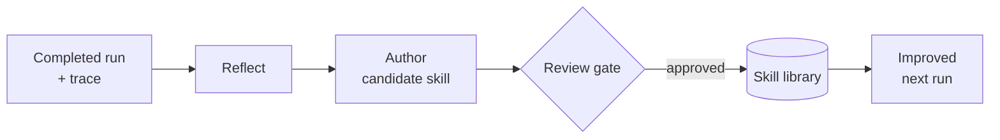

**What it does.** Reflect on a completed run, author a candidate skill, put it through a review gate, improve the next run.

**Beats a grounded baseline when.** The same task recurs often enough that a captured lesson pays back the reflection cost.

**How it differs from the alternatives.** **Improves run over run** by reflecting on a completed run and authoring a reusable skill behind a review gate. Differs from **01/05** (which are static within a run) by changing future behaviour. Requires a governance gate. Choose it for recurring tasks that should get better over time.

- **Accepts → produces:** Decision, Trace → SkillUpdate
- **Evaluator:** hybrid on the trajectory
- **Cost / latency class:** medium / slow
- **Composes with:** 13, 01, 02
- **Known failure modes:** ungrounded self critique, self justification, unreviewed self modification
- **Azure services:** foundry_agent_service, blob_storage

### 11 · Program synthesis and test-repair
*Family: Artefact*

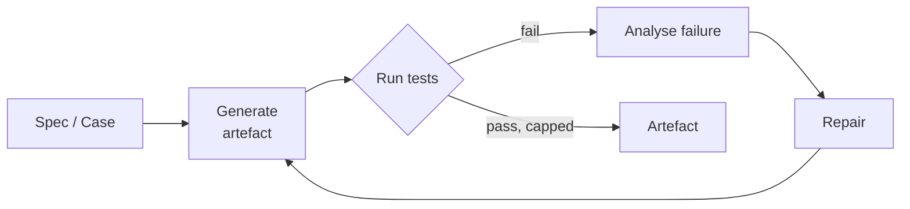

**What it does.** Generate an artefact, run the tests, analyse the failure, repair, repeat under a cap.

**Beats a grounded baseline when.** The deliverable is an artefact that a test suite can judge, so the evaluator is free and cannot be flattered.

**How it differs from the alternatives.** The deliverable is a **validated artefact** — code, a migration — judged by a **free, un-flatterable test suite**. Differs from **01** (whose model judge can be gamed) by using tests as the evaluator. Choose it when success is 'the tests pass', not 'the prose reads well'.

- **Accepts → produces:** Case, Spec → Artefact
- **Evaluator:** test_based on the final
- **Cost / latency class:** medium / slow
- **Composes with:** 08, 13, 01
- **Known failure modes:** weak tests reward hacking, sandbox escape, overfitting to tests
- **Azure services:** foundry_agent_service, container_apps

### 04 · Neuro-symbolic reasoning
*Family: Enterprise control*

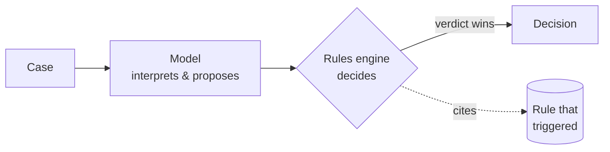

**What it does.** The model interprets and proposes, a deterministic rules engine decides. The engine's verdict wins.

**Beats a grounded baseline when.** A policy must hold every time, not usually. A tendency is not a guarantee.

**How it differs from the alternatives.** A deterministic rules engine **decides**; the model only proposes. Differs from **01** by guaranteeing a policy holds *every* time, not *usually*; differs from **13** in that a *rule* decides, not a *human*. Choose it for hard, auditable policy compliance.

- **Accepts → produces:** Case, Decision → Decision
- **Evaluator:** rule_based on the final
- **Cost / latency class:** low / fast
- **Composes with:** 01, 02, 03, 05, 08, 09, 10
- **Known failure modes:** rules drift from policy, unmodelled cases
- **Azure services:** foundry_agent_service, azure_functions

### 13 · Human-in-the-loop reasoning
*Family: Enterprise control*

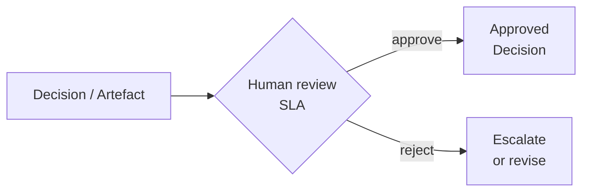

**What it does.** A human occupies a named point in the reasoning, with an SLA, an escalation path and a recorded reason. Not a pattern folder of its own: §13 folds into §11, because Durable's human-interaction pattern IS the HITL implementation.

**Beats a grounded baseline when.** Failure is expensive enough to be worth a person's attention budget.

**How it differs from the alternatives.** A **human** occupies a named point in the reasoning, with an SLA and a recorded reason. Differs from **04** in that a *human* decides, not a *rule*; implemented via the workflow pattern (**08**). Choose it when human judgement is part of output *quality*, not merely a rubber-stamp.

- **Accepts → produces:** Decision, Artefact, Sequence → Decision
- **Evaluator:** human on the final
- **Cost / latency class:** low / process
- **Composes with:** 01, 02, 03, 05, 07, 08, 09, 10, 11
- **Known failure modes:** approval theatre, attention budget exhaustion, unbounded wait
- **Azure services:** durable_functions, table_storage

### 12 · The pattern compiler
*Family: Meta*

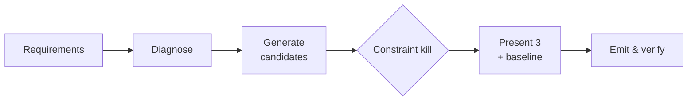

**What it does.** Requirements document in, verified agent harness out. Diagnoses against the §2 selection matrix, composes candidates from the catalogue over five operators, kills the illegal ones deterministically, presents three plus a baseline, and emits a folder that passes structural verification.

**Beats a grounded baseline when.** The same translation from requirements to architecture happens repeatedly and its quality currently depends on who is holding the pen.

**How it differs from the alternatives.** The **meta** pattern: this tool itself — requirements in, a verified harness out. Not usually deployed as a runtime agent; it *builds* the others.

- **Accepts → produces:** Spec, Case → Artefact
- **Evaluator:** hybrid on the trajectory
- **Cost / latency class:** medium / slow
- **Composes with:** 13
- **Known failure modes:** pattern astrology, invented cost figures, catalogue drift, unevaluated builder
- **Azure services:** foundry_agent_service, app_insights

## At a glance — comparison matrix

| # | Pattern | Family | Answers | Evaluator | Cost | Latency |
|---|---|---|---|---|---|---|
| 00 | Grounded single agent | Baseline | Missing or stale facts | model_judge | low | fast |
| 01 | From chain-of-thought to deliberate reasoning | Reasoning & judgement | Correct facts, weak judgement | model_judge | medium | medium |
| 05 | Tree of thoughts and branching reasoning | Reasoning & judgement | Multiple plausible interpretations, first answer often wrong | hybrid | high | slow |
| 02 | Reasoning and acting, the ReAct loop | Action & tools | Needs tools, data lookups or actions mid-reasoning | hybrid | medium | medium |
| 09 | Search-based reasoning and controlled exploration | Planning | Planning under constraints with many valid options | hybrid | high | slow |
| 10 | Graph reasoning | Context | Relationship discovery, no single document has the answer | hybrid | medium | medium |
| 06 | Memory-augmented reasoning | Context | Needs recall across sessions, personalised or accumulating context | hybrid | low | fast |
| 03 | Multi-agent orchestration and model selection | Orchestration | Workflow too large or heterogeneous for one agent | model_judge | high | slow |
| 08 | Workflow-state reasoning with human in the loop | Process | Long-running business process with defined stages | hybrid | medium | process |
| 07 | Reflection and dynamic skill acquisition | Improvement | Repeated task that should improve run over run | hybrid | medium | slow |
| 11 | Program synthesis and test-repair | Artefact | Validated artefacts required, not advice | test_based | medium | slow |
| 04 | Neuro-symbolic reasoning | Enterprise control | Deterministic policy compliance required | rule_based | low | fast |
| 13 | Human-in-the-loop reasoning | Enterprise control | Human judgement is part of output quality, not just a gate | human | low | process |
| 12 | The pattern compiler | Meta | composition / control | hybrid | medium | slow |

---

*Diagrams and metadata are generated directly from the pattern catalogue, so they match the engine that produces your recommendations.*