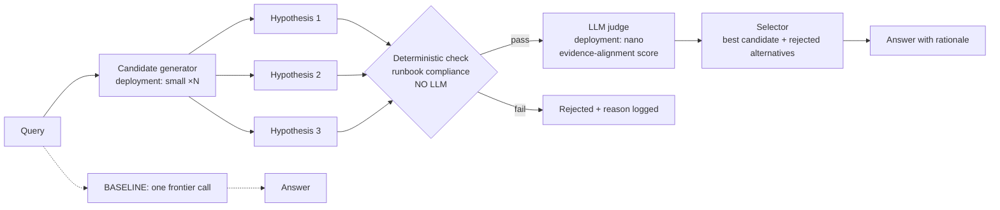

# Pattern 01 — Deliberate Reasoning (§5)

**Problem class:** correct facts, weak judgement. The first plausible answer is often wrong.
**Scenario:** manufacturing diagnostics — pipeline stalls after an upgrade.

Control loop: **generate → evaluate → select** (§3). The deterministic check runs
*before* any judge call — rules the business already trusts are free and unfoolable.
Budgets (`budgets.yaml`) bound candidates, tokens and wall clock.

**State sharing shown here:** in-process workflow state (candidates + scores live in
the MAF workflow context for a single run). Contrast with pattern 03 (typed
contracts between agents) and pattern 02 (thread state in Agent Service).
