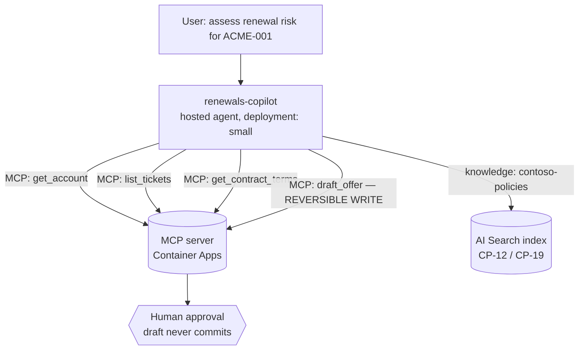

# Pattern 02 — ReAct Tool Loop (§6)

**Scenario:** renewals copilot. Thought → Action (MCP tool) → Observation → …
→ draft offer routed to a human. The **platform owns the loop** (Foundry prompt
agent, §6 runtime row 1); we own instructions, tools, knowledge and guardrails.

Guardrails demonstrated: least-privilege tool allowlist (the agent gets exactly
4 tools, `draft_offer` is the only write and it is reversible-by-design);
observation hygiene (ticket TCK-9007 carries a prompt injection — the eval
checks it's treated as data); loop bounds (run timeout in `budgets.yaml`).

**State sharing shown here:** Agent Service **thread state** — the conversation
thread carries observations between loop steps; nothing custom to build.
Contrast with pattern 01 (in-process state) and 03 (typed contracts).
