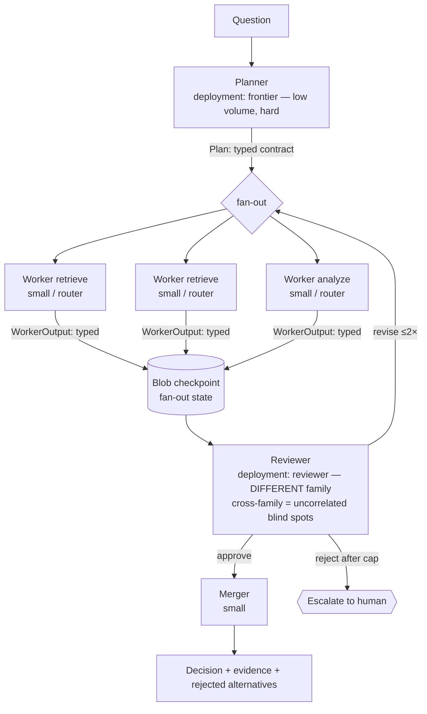

# Pattern 03 — Multi-Agent Orchestration & Model Selection (§12)

**Scenario:** "Where should we invest retention budget next quarter?" — a
decomposable analysis over segment data.

Every handoff is a **pydantic contract** (`common/reasoning_common/contracts.py`)
— §12: "free-text handoffs are where multi-agent systems silently fail." The
reviewer runs a different model family than the generators. Debate is capped at
2 revision rounds, then a human, not a loop.

Expressed as a **MAF workflow** in `src/maf_workflow.py` (executors + fan-out
edges); `src/workflow.py` carries a dependency-free fallback of the same graph
so the pattern runs even when the MAF package version drifts.

**State sharing shown here:** typed contracts on the edges + a **Blob Storage
checkpoint** of fan-out state (survives process death; inspectable mid-run) —
the third mechanism after in-process (01) and thread state (02).
