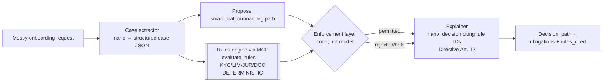

# Pattern 04 — Neuro-Symbolic Reasoning (§14)

**Scenario:** bank customer onboarding. The LLM interprets messy requests and
drafts a path; a **deterministic rules engine** (real MCP tool `evaluate_rules`,
versioned code, same input → same output) decides what is *permitted*. Prompts
create tendencies; engines create guarantees.

The enforcement layer is ~20 lines of Python: whatever the proposer says, the
engine's verdict wins. The `prompt-rules-only` variant deletes the engine and
puts the rules in the prompt instead — run the eval and watch the guarantee
become a tendency.

Knowledge base: the (fictional) EU Onboarding Directive is indexed; the
explainer cites Art. 12 (explainability) — decisions without cited rules are
invalid per CP-19 §2.3.
