# Pattern 05 — Tree of Thoughts / Branching Reasoning (§8)

**Scenario:** the white paper's own — unusual authentication for user `mchen`.
Five hypotheses stay ALIVE simultaneously; evidence discriminates; commitment
is delayed until it does. The seeded data has a deliberate nuance: the geo
anomaly is REAL travel (H1 partially true) while the actual compromise is a
consent-phished OAuth app — branches must be eliminated by evidence, not vibes.

```mermaid
flowchart TD
    Q[Alert: unusual auth for mchen] --> H[Generate 5 hypotheses<br/>deployment: small]
    H --> B1[benign travel] & B2[compromised identity] & B3[risky OAuth app] & B4[service-account misuse] & B5[config false positive]
    B1 & B2 & B3 & B4 & B5 --> E[Per-branch evidence round<br/>each branch requests ONE tool<br/>MCP: auth/travel/oauth/rules/incidents]
    E --> S[Score branches<br/>deployment: nano<br/>evidence alignment 0-10]
    S --> P{Prune: keep top-k<br/>+ optional HUMAN branch-kill<br/>run-interactive}
    P -->|rounds < max| E
    P -->|done| V[Verdict synthesist<br/>surviving hypothesis + eliminated<br/>ones WITH discriminating evidence]
```

Steering scales here (per docs/FOUNDRY-MAF-COVERAGE §4): the analyst kills or
boosts branches at prune boundaries — steering the *search budget*, the most
valuable thing a domain expert contributes. Prompt Shields runs over every
observation (an OAuth publisher description carries a planted instruction).

`src/maf_workflow.py` expresses the same graph with **verified** MAF
`add_fan_out_edges`/`add_fan_in_edges`, and `make viz` renders the REAL built
graph via `WorkflowViz.to_mermaid` — the diagram can no longer lie about the code.
