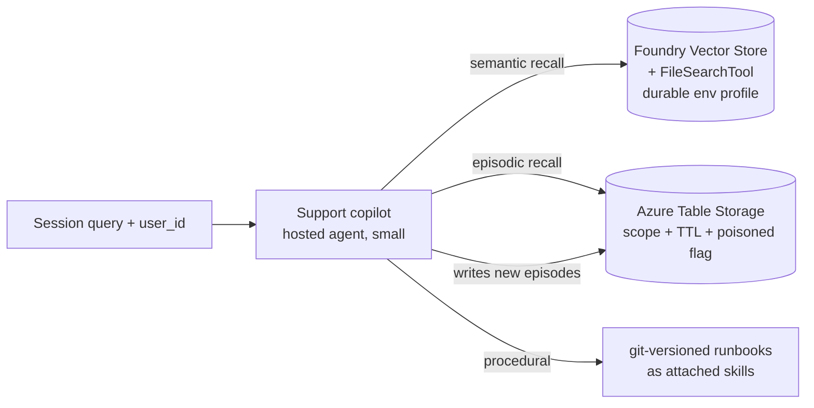

# Pattern 06 — Memory-Augmented Reasoning (§9)

**Scenario:** support copilot across THREE scripted sessions for two users.
Session 1 learns the environment, session 2 tries a fix that fails, session 3
picks up where 2 left off without re-asking. The evals include a
**forgetting** row (expired episodic memory must NOT be recalled) and a
**security-trimming** row (user B cannot recall user A's memory).

Four memory types made physical (§9). The read/write **policy layer** is what
makes it enterprise-grade: scope filters at read time, TTL for expiry,
poisoned flag for content derived from untrusted observations.

Two runtime paths, one variant flag: `memory=explicit` uses vector store +
Tables directly (works everywhere, shown by default); `memory=managed` uses
Foundry Agent Service built-in memory where it's enabled. Both routes score
against the same eval dataset — same behaviour, different substrate.
