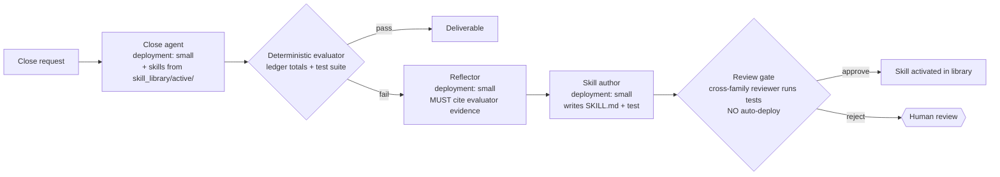

# Pattern 07 — Reflection & Dynamic Skill Acquisition (§10)

**Scenario:** month-end close copilot. Run N sees an unfamiliar ledger format
(fixture `subsidiary_zeta.csv`) and fails. Reflection distils *why* into
grounded lessons; the skill author drafts a `parse-alternate-ledger` skill
and its acceptance test; the review gate (or a human) approves; run N+1
loads the skill from `skill_library/active/` and succeeds. The N vs N+1 delta
is the eval.

Two update channels (§10): instruction rewriting (Agent Optimizer, phase-1
loop reused) and **skill acquisition** (this pattern's core). Both are
governance-gated: rewrites land as git-reviewable files; skill activation
requires passing tests AND cross-family review; every activation is
reversible in one step.
