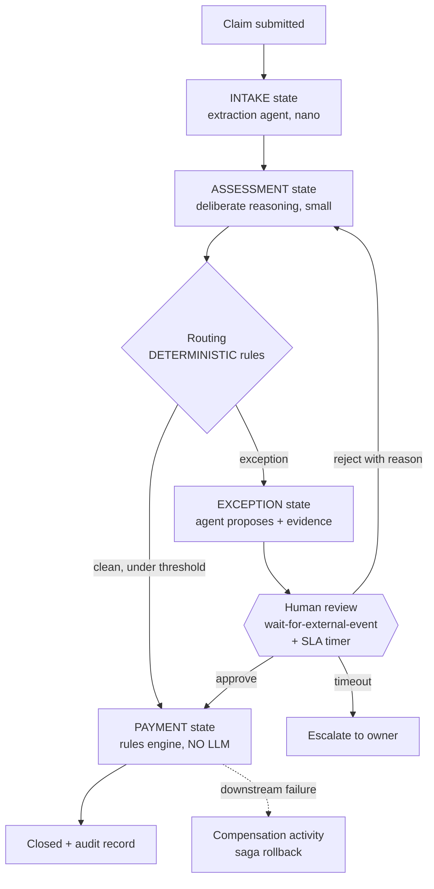

# Pattern 08 — Workflow-State Reasoning + Human-in-the-Loop (§11 + §13)

**Scenario:** claims processing across days. The process stays a governed state
machine; agents occupy specific decision points inside it. §13 folds in here
deliberately — Durable's human-interaction pattern IS the HITL implementation.

**Two orchestration layers, deliberately (§11):** Durable Functions owns the
*business process* (checkpointed, replay-safe, survives restarts, week-long
waits); MAF/agents own the *reasoning* inside decision points. Deterministic
transitions stay deterministic — the payment state has no LLM at all.

Runs two ways from one codebase: `mode=local` drives the same state machine
in-process (works everywhere, used by evals) and `mode=durable` deploys the
Function App. The state machine, agents and evaluators are shared — only the
host differs.
