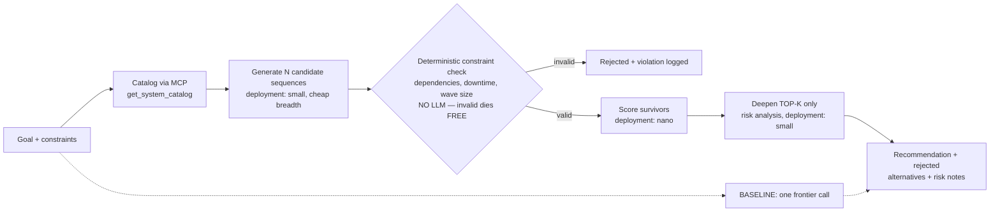

# Pattern 09 — Search-Based Reasoning & Controlled Exploration (§7)

**Scenario:** the white paper's retailer modernisation — "what should we
migrate first?" is planning, not retrieval. The answer is one point in a space
of valid wave sequences.

The §7 resource-allocation idea, live: **spend breadth cheaply, kill invalid
options for free, spend depth only where a better decision is likely.** The
`no-precheck` ablation scores every candidate with a model instead — run
`make cost` after both and the argument makes itself.

Observation hygiene: catalog notes are third-party text (S8 carries a planted
instruction); observations pass through **Prompt Shields**
(`reasoning_common.safety`) before reaching any model, logged either way.
