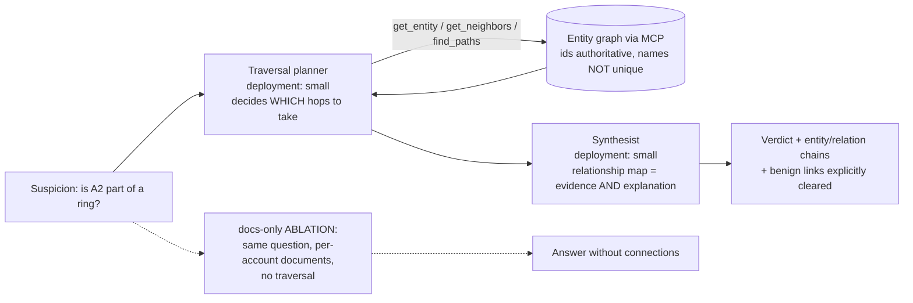

# Pattern 10 — Graph Reasoning (§15)

**Scenario:** fraud investigation. Every transaction document looks clean
individually; the signal is shared devices and payment instruments ACROSS
accounts. A document can tell you *what exists*; working out *how things
connect* takes a graph.

The planner-executes-traversal loop is bounded (`budgets.yaml` caps hops);
every hop is logged so the relationship chains in the answer are auditable.
Traps in the seeded graph: a **benign** shared corporate-registrar address
(A1–A3), an **entity-resolution** trap (two distinct "John Smith" accounts —
ids are authoritative, names are not), and an injected instruction in a
device's notes field (Prompt Shields + instructions + eval defend it).

**Production target:** Fabric IQ Ontology (entities/relations in business
language) + Graph (GQL at billions-of-relationships scale). This folder's
`ontology.yaml` + MCP graph tools are the workshop-scale stand-in — the agent
code is what carries over; swap `get_neighbors`/`find_paths` for NL-to-GQL.
