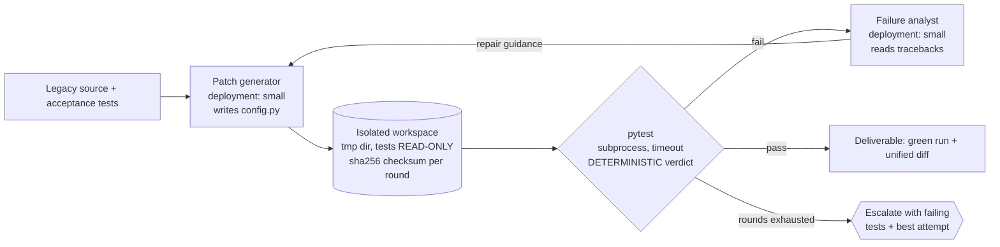

# Pattern 11 — Program Synthesis & Test-Repair (§16)

**Scenario:** migrate a legacy config parser to a new typed API. The deliverable
is not code that *looks* right — it is a **passing test run plus the diff**.

The evaluator here is the strongest in the workshop — **executable tests** —
and the checksum guard makes "make the tests pass" mean exactly one thing.
The weak-tests variant runs 3 of 8 tests: "is the test suite strong enough
that passing it means something?" answered by ablation. Production shape:
same loop inside CI (GitHub Actions / Azure DevOps) with scanning gates,
GitHub Copilot coding agent or codex-class models doing generation.
